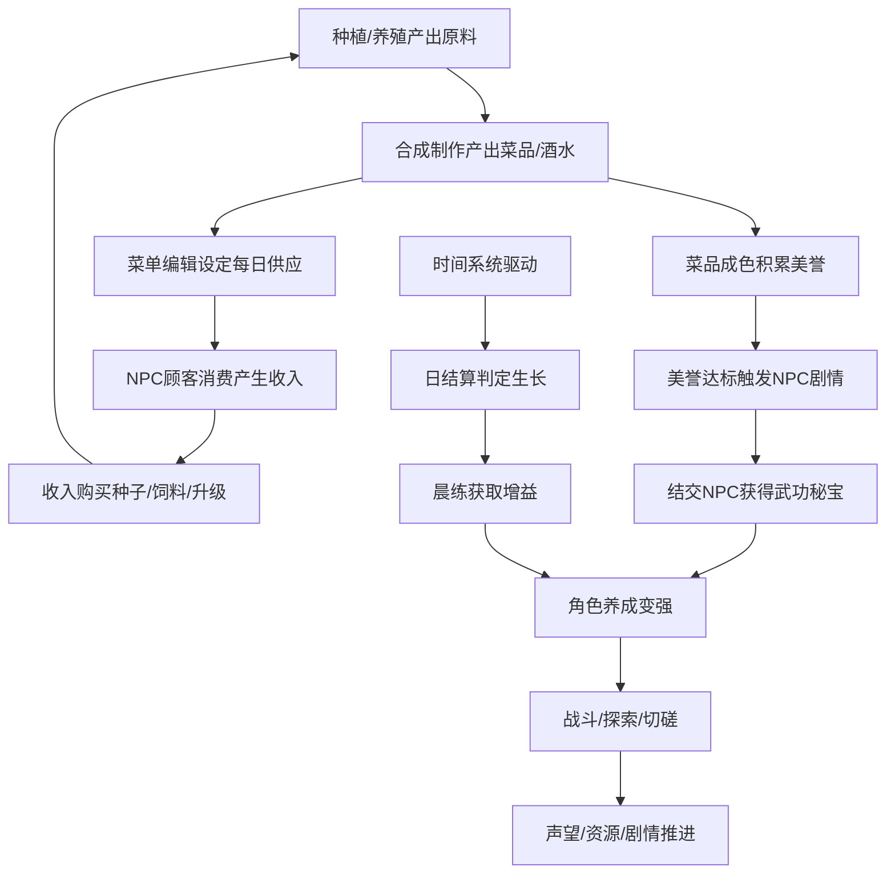
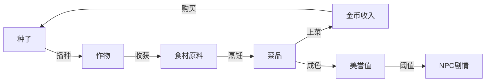

# 仙侠客栈 — 时间触发汇总、核心闭环与极简H5验证计划

---

## 二、时间触发类系统汇总

> 这些系统由时间推进自动触发，是游戏骨架的核心驱动。

| 编号 | 系统名称     | 触发时机     | 核心行为                                   |
| ---- | ------------ | ------------ | ------------------------------------------ |
| T1   | 时间流逝     | 持续         | 12时辰推进，1时辰=现实2分钟                |
| T2   | 强制睡眠     | 寅时到达     | 强制结束当天，惩罚性延迟醒来               |
| T3   | 日结算       | 睡觉触发     | 统计页面+存档+判定动植物生长               |
| T4   | 作物生长判定 | 日结算时     | 酉时前种植→生长+1；检查浇水/施肥/虫病/杂草 |
| T5   | 动物产出判定 | 日结算时     | 检查饲料/水→决定产出进度                   |
| T6   | 饲料晨判     | 每日早开始   | 禽类依次消耗食盆饲料                       |
| T7   | 饲料晚判     | 每日晚上结束 | 未获得饲料的再判定一次                     |
| T8   | 发酵升级     | 每4天        | 发酵坛品质递进                             |
| T9   | 季节切换     | 每6周        | 影响可种植作物/热卖菜品/时辰活动           |
| T10  | 作物过季     | 季节切换时   | 过季未收获→枯萎死亡                        |
| T11  | 种猪怀孕     | 持续条件判定 | 宽松+有种猪+总量>=2→怀孕                   |
| T12  | 种猪生产     | 怀孕2季度后  | 生3只小猪                                  |
| T13  | 美誉扣除     | 顾客点菜超时 | 成色×0.5扣除美誉                           |
| T14  | 菜单生效     | 次日         | 菜单调整次日才生效                         |

---

## 三、核心玩法闭环分析

### 3.1 文档声明的核心玩法

文档行5明确：**模拟经营、RPG养成、ROGUE回合战斗、文字剧情**

### 3.2 从系统穷举推导的核心循环

### 3.3 最小可玩闭环识别

从上述循环中提取**最短可验证链路**：

> **种植→收获→烹饪→上菜→获得收入→购买种子→再种植**

这条闭环串联了文档标注"优先做"的食物合成与种植系统，同时涉及时间推进和日结算，是最核心的玩法验证点。

---

## 四、极简H5验证 — 需提前定义的核心要素

### 4.1 核心交互流程定义

必须明确以下交互链路的页面流转和操作步骤：

| 流程编号 | 流程名称 | 涉及页面/状态             | 关键操作                         |
| -------- | -------- | ------------------------- | -------------------------------- |
| F1       | 一日流程 | 主界面→日结算→晨练→主界面 | 时间推进→睡觉→统计→选晨练→新一天 |
| F2       | 种植流程 | 田地→背包→田地            | 开垦→选种→放置→浇水→等待→收获    |
| F3       | 烹饪流程 | 灶台界面                  | 选菜谱→选食材→制作→等待→收获     |
| F4       | 经营流程 | 菜单编辑→客栈→主界面      | 编辑菜单→顾客来→上菜→收入        |

### 4.2 关键数据流转定义

必须明确以下数据在生产-消费链中的流转：

### 4.3 最小可玩闭环定义

**MVP闭环 = F1一日流程 + F2种植流程 + F3烹饪流程 的最小交集**

具体来说，玩家在H5中需要能够：

1. ✅ 看到时间在流逝（时辰推进）
2. ✅ 在田地中播种→浇水→等待生长→收获
3. ✅ 在灶台用收获的食材制作一道菜（如红烧肉）
4. ✅ 将菜品加入菜单
5. ✅ 看到NPC顾客来消费并获得金币
6. ✅ 用金币购买新种子
7. ✅ 到寅时触发日结算→选晨练→进入新一天

### 4.4 需要硬编码的最小数据集

| 数据类型 | 最小集内容                                                           |
| -------- | -------------------------------------------------------------------- |
| 作物     | 葱（3天周期，春夏秋）                                                |
| 菜谱     | 红烧肉（肉菜/炖菜，需猪肉+葱+姜+辣椒+花雕酒+酱油+高汤+香料+水+柴火） |
| 调料链   | 酱油（黄豆+面粉+酱曲+盐→烧锅→发酵）                                  |
| 酒链     | 花雕酒（糯米+甜酒曲→烧锅→蒸锅→发酵）                                 |
| 动物     | 鸡（产蛋，4天周期）                                                  |
| 时辰     | 12时辰名称+对应活动时段                                              |
| 季节     | 春/夏/秋/冬+奖励季                                                   |

---

## 五、极简H5验证 — 推进步骤清单

### Phase 0: 前置定义（编码前必须完成）

- [ ] **P0-1** 定义时间常量：1时辰=现实2分钟，1日=12时辰=现实24分钟（简化为整数）
- [ ] **P0-2** 定义时辰表：12个时辰的名称、排序、活动标签
- [ ] **P0-3** 定义作物数据表：至少1种作物的完整属性（名称/季节/周期/产出物/产出量）
- [ ] **P0-4** 定义菜谱数据表：至少1道菜的完整配方（红烧肉：主材/配材/调料/杂项/基础成色）
- [ ] **P0-5** 定义食材-菜品映射：哪些食材可替代、哪些固定
- [ ] **P0-6** 定义NPC顾客行为模型：来店频率/点菜逻辑/等待时间/支付金额
- [ ] **P0-7** 定义日结算输出格式：统计页面展示哪些数据项
- [ ] **P0-8** 定义页面流转图：每个操作跳转到哪个界面，返回逻辑如何

### Phase 1: H5骨架搭建

- [ ] **P1-1** 搭建单页应用框架（推荐Vue3+Vite或纯HTML/JS）
- [ ] **P1-2** 实现时间系统：时辰显示+自动推进+季节/日期计算
- [ ] **P1-3** 实现主界面布局：顶部时间栏+中部场景区+底部操作栏
- [ ] **P1-4** 实现场景切换：田地/客栈/灶台三个场景的Tab切换

### Phase 2: 种植系统最小实现

- [ ] **P2-1** 田地网格渲染：3×3可交互地块
- [ ] **P2-2** 开垦操作：点击空地→开垦→可种植状态
- [ ] **P2-3** 播种操作：选中种子→点击地块→幼苗状态
- [ ] **P2-4** 浇水操作：点击地块→湿地状态标记
- [ ] **P2-5** 生长判定：日结算时检查浇水→生长天数+1
- [ ] **P2-6** 收获操作：生长天数>=周期→点击收获→食材入背包

### Phase 3: 烹饪系统最小实现

- [ ] **P3-1** 灶台界面：左侧菜谱列表+右侧制作区
- [ ] **P3-2** 食材选择：从背包拖/点食材到配方栏位
- [ ] **P3-3** 制作判定：配方匹配→显示成色→点击制作
- [ ] **P3-4** 制作进度：进度条倒计时→完成→收获菜品

### Phase 4: 经营闭环最小实现

- [ ] **P4-1** 菜单编辑：将已制作菜品加入每日菜单
- [ ] **P4-2** NPC顾客生成：按时辰概率生成顾客→点菜单中的菜
- [ ] **P4-3** 上菜与收入：顾客点菜→从库存扣除菜品→获得金币
- [ ] **P4-4** 商人购买：用金币购买种子/饲料

### Phase 5: 日循环闭环

- [ ] **P5-1** 睡觉触发：点击床/寅时强制→进入日结算
- [ ] **P5-2** 日统计页面：展示当天收获/烹饪/收入数据
- [ ] **P5-3** 晨练选择页面：5选1→确认→新一天开始
- [ ] **P5-4** 强制睡觉惩罚：跳过晨练+延迟醒来

### Phase 6: 验证与调优

- [ ] **P6-1** 完整闭环测试：从Day1晨练→种植→烹饪→经营→睡觉→Day2
- [ ] **P6-2** 时间节奏调优：确认21分钟一天的节奏是否合理
- [ ] **P6-3** 数值平衡初调：作物周期/菜品成色/顾客支付的比例关系
- [ ] **P6-4** 交互体验优化：操作反馈/状态提示/错误引导

---

## 六、剔除系统清单（H5 MVP不包含）

| 系统                | 剔除原因                              |
| ------------------- | ------------------------------------- |
| S2 角色控制与行走   | H5用场景Tab替代自由行走               |
| S8 食物属性与进食   | 文档标注"不着急做"，与核心闭环无关    |
| S10 美誉触发NPC剧情 | 依赖NPC羁绊系统，MVP无此系统          |
| S12 发酵系统        | 链路过长，MVP可简化调料为直接购买     |
| S13 烧锅系统        | 同上，中间产物链路过长                |
| S14 蒸锅系统        | 同上                                  |
| S16 种植负面效果    | 文档标注"先不制作"                    |
| S17 种植技能        | MVP固定1级，无需技能树                |
| S18 养殖技能        | 同上                                  |
| S19-S22 鸡/猪养殖   | 链路复杂，MVP仅保留鸡产蛋作为最简验证 |
| S1 主菜单           | H5直接进入游戏，无需菜单              |
| S6 晨练下级菜单     | MVP简化为5选1，无武学下级菜单         |
| S22 畜棚外部管理    | 依赖技能解锁，MVP不实现               |

---

## 七、H5技术选型建议

| 维度       | 建议             | 理由                                   |
| ---------- | ---------------- | -------------------------------------- |
| 框架       | Vue3 + Vite      | 轻量、组件化、AI工具生成代码保真度高   |
| UI         | 纯CSS/简易组件库 | 避免引入重型UI库增加复杂度             |
| 状态管理   | Pinia或reactive  | 游戏状态集中管理，便于日结算时批量判定 |
| 数据持久化 | localStorage     | 存档读取的最简实现                     |
| 部署       | 静态HTML         | 无需后端，本地打开即玩                 |
